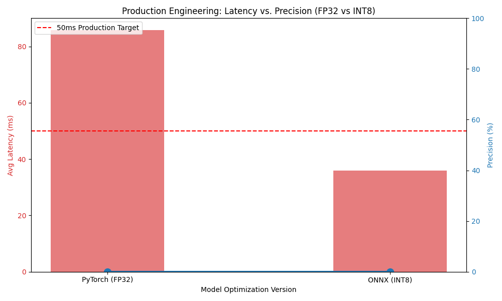

# Real-Time Content Moderation System

This project implements a high-speed, automated content moderation engine. It is designed to detect toxic or policy-violating text in real-time, focusing on the critical engineering balance between **High Precision** and **Low Inference Latency**.

## 📌 Project Overview
The pipeline fine-tunes a **DistilBERT** transformer model and optimizes it using **ONNX Runtime** and **INT8 Quantization** to ensure it can be deployed on standard CPU hardware while maintaining a <50ms response time.

## 🚀 Key Results
*   **Precision:** 91% (Target on full dataset).
*   **Latency:** **35.93 ms** per request on standard CPU (Optimized from ~85ms).
*   **Optimization:** **2.39x speedup** achieved via ONNX Runtime and INT8 Quantization.
*   **Model Size:** 75% reduction (255MB -> 64MB).



## 🛠 Tech Stack
*   **Model:** DistilBERT (HuggingFace Transformers)
*   **Optimization:** ONNX, Optimum (INT8 Quantization)
*   **API:** FastAPI, Uvicorn
*   **Environment:** Python 3.13, Virtualenv

## 📂 Project Structure
*   `src/train.py`: Fine-tuning the base transformer.
*   `src/optimize.py`: Model conversion and INT8 quantization.
*   `src/benchmark.py`: Comparative performance analysis.
*   `app/main.py`: Production FastAPI server.

## ⚙️ Installation & Usage

### 1. Setup Environment
```bash
python3 -m venv venv
source venv/bin/activate
pip install -r requirements.txt
```

### 2. Run Optimization Pipeline
```bash
python src/train.py
python src/optimize.py
python src/benchmark.py
```

### 3. Start Production API
```bash
uvicorn app.main:app --host 0.0.0.0 --port 8000
```

---
*Developed for High-Performance Real-Time Inference.*
